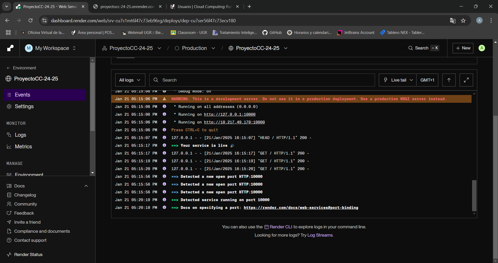

# Hito 5: Despliegue de la Aplicación en un PaaS

## Descripción y justificación del PaaS seleccionado

Para el despliegue de la aplicación, se seleccionó **Render** como Plataforma como Servicio (PaaS). A continuación, se justifican las razones de esta elección:

1. **Facilidad de uso**:
   - Render ofrece una interfaz intuitiva para configurar y desplegar aplicaciones directamente desde un repositorio de GitHub.
   - Proporciona soporte para configuraciones Docker, lo que permite reproducir el entorno de desarrollo y producción con facilidad.

2. **Despliegue automático desde GitHub**:
   - Render permite integrar el repositorio de GitHub y configurar despliegues automáticos cada vez que se realiza un `push` a la rama principal.

3. **Soporte en Europa**:
   - Render ofrece regiones de despliegue en Europa, cumpliendo con las regulaciones legales necesarias para proyectos europeos.

4. **Gratuito en niveles iniciales**:
   - Render permite desplegar aplicaciones de forma gratuita para pequeñas aplicaciones y proyectos personales, cumpliendo con los requisitos de costo.

5. **Reproducción del entorno**:
   - Con la integración de Docker y la posibilidad de definir configuraciones en un archivo reproducible (como el `Dockerfile`), Render asegura que el despliegue sea replicable.

---

## Configuración del despliegue en Render

### Pasos para Configurar el Despliegue

1. **Creación de una cuenta en Render**:
   - Se accedió a la página [Render](https://render.com/) y se creó una cuenta gratuita.

2. **Vinculación del repositorio de GitHub**:
   - En el panel de Render, se seleccionó la opción para añadir un nuevo servicio web y se vinculó el repositorio de GitHub donde se encuentra el proyecto.

3. **Configuración del servicio**:
   - Se especificaron los siguientes detalles para el despliegue:
     - **Branch**: `main`.
     - **Runtime**: Docker.
     - **Dockerfile**: El archivo `Dockerfile` del proyecto se utilizó para definir la imagen y los comandos necesarios para ejecutar la aplicación.
     - **Región**: Europa.


### Archivo `Dockerfile`

El archivo `Dockerfile` utilizado para el despliegue:

```dockerfile
FROM python:3.12-slim

# Establecer el directorio de trabajo
WORKDIR /app

# Copiar todo el contenido del proyecto al contenedor
COPY . /app

# Instalar las dependencias
RUN pip install --no-cache-dir -r requirements.txt

# Establecer PYTHONPATH para que Python reconozca el paquete `app`
ENV PYTHONPATH=/app

# Exponer el puerto que usa Flask
EXPOSE 5000

# Comando para ejecutar la aplicación
CMD ["python", "app/app.py"]
```

---

## Configuración del despliegue automático con GitHub Actions

### Archivo de flujo de trabajo (`.github/workflows/build-and-publish.yml`)

El siguiente archivo de GitHub Actions se utilizó para realizar pruebas y despliegues automáticos:

```yaml
name: Build, Test, and Publish Docker Image

on:
  push:
    branches:
      - main

jobs:
  build-test-publish:
    runs-on: ubuntu-latest

    steps:
      - name: Checkout code
        uses: actions/checkout@v2

      - name: Log in to GitHub Docker Registry
        run: echo "${{ secrets.GH_TOKEN }}" | docker login ghcr.io -u ${{ github.actor }} --password-stdin

      - name: Build Docker image
        run: |
          docker build -t ghcr.io/${{ github.repository_owner }}/proyectocc-24-25:latest .

      - name: Run Tests
        run: |
          pytest app/tests

      - name: Push Docker image to GitHub Packages
        if: success()
        run: |
          docker push ghcr.io/${{ github.repository_owner }}/proyectocc-24-25:latest
```

---

## Funcionamiento correcto del despliegue

La aplicación fue desplegada correctamente en Render y está disponible en la siguiente URL:

**[https://proyectocc-24-25.onrender.com/](https://proyectocc-24-25.onrender.com/)**

### Capturas de Pantalla

- Captura mostrando la aplicación en funcionamiento:
  
- 

---

## Pruebas de prestaciones de la aplicación

Se realizaron pruebas automáticas utilizando `pytest` para validar los principales endpoints y funcionalidades de la aplicación.

### Resultados de las pruebas

Todas las pruebas pasaron correctamente, asegurando el correcto funcionamiento de los endpoints y las funcionalidades de la aplicación.

### Comando para ejecutar las pruebas

```bash
pytest app/tests
```

---

## Conclusión

El despliegue de la aplicación en Render fue exitoso y cumple con los requisitos del Hito 5:

- Se seleccionó un PaaS adecuado.
- Se configuró un despliegue reproducible utilizando un `Dockerfile`.
- Se integró GitHub Actions para el despliegue automático.
- La aplicación está funcionando correctamente en el PaaS.
- Se realizaron pruebas para validar el funcionamiento de la aplicación.
